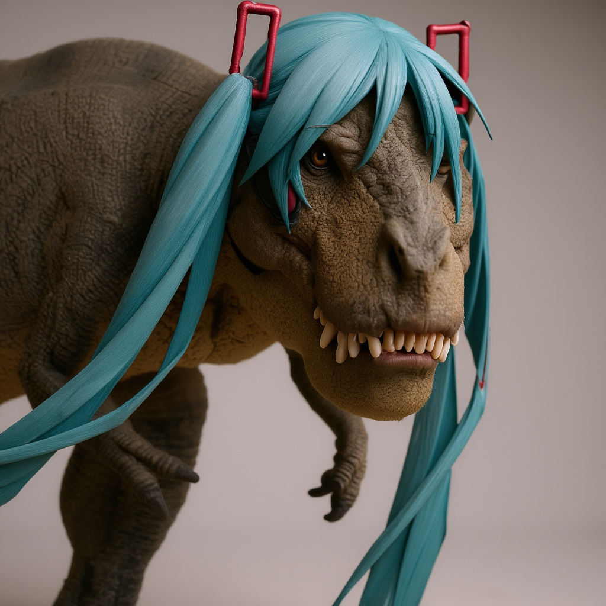
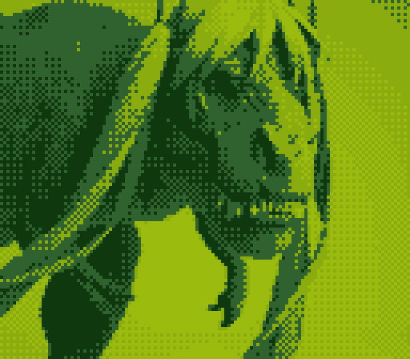

# GB Camera Image Converter

This Python script converts regular images into **Game Boy Camera–style pictures** with authentic resolution, dithering, palette limitations, and aspect ratios.

It supports both **single image conversion** and **batch folder processing**, with optional retro color palettes and dithering effects.

***

## Features
- Hardware‑accurate Game Boy Camera resolution (128×112 pixels)
- Preset and custom color palettes (grayscale, green, berry, frost, etc.)
- Optional auto‑contrast adjustment
- Dithering intensity control
- Automatic or forced portrait/landscape orientation
- Upscales output ×4 for easier sharing
- Batch folder conversion

***

## Installation

1. Clone or download the script.
2. Install the Python dependencies:

```bash
pip install pillow numpy
```

***

## Usage

### Single Image Conversion

```bash
python gb_camera_converter.py input.jpg -o output.png --autocontrast --palette green
```

#### Arguments:

| Argument | Description | Default |
|----------|-------------|---------|
| `input_image` | Path to input image | *required* |
| `-o, --output` | Output file path | `gb_output.png` |
| `-c, --contrast` | Manual contrast factor | `1.0` |
| `--autocontrast` | Apply automatic contrast | *disabled* |
| `--dither-intensity` | Dithering strength (`0 = posterize`) | `1.0` |
| `--palette` | Palette preset name or `4` custom hex codes | `["grayscale"]` |
| `--orientation` | `auto`, `landscape` (128×112), or `portrait` (112×128) | `auto` |

#### Example:
```bash
# Convert with berry palette, strong dithering
python gb_camera_converter.py cat.png -o cat_gb.png --dither-intensity 1.5 --palette berry
```

```bash
# Convert with a custom palette (dark red to light pink)
python gb_camera_converter.py mug.jpeg -o mug_gb.png --palette "#210002" "#64000b" "#b51d2a" "#ffd8d6"
```

***

### Batch Conversion

Use the **`convert_folder_to_gb_camera`** function to process an entire folder:

```python
from gb_camera_converter import convert_folder_to_gb_camera

convert_folder_to_gb_camera(
    input_folder="input_images",
    output_folder="output_images",
    contrast=1.2,
    use_autocontrast=True,
    dither_intensity=1.0,
    palette=["grayscale"],
    use_random_palette=True,
    orientation="auto"
)
```

This will:
- Scan `input_images/` for supported files (`jpg`, `png`, `bmp`, `gif`, `tiff`)
- Apply Game Boy Camera conversion
- Save results into `output_images/`
- Assign a **random palette** (if `use_random_palette=True`)

***

## Available Preset Palettes

- **grayscale** → `#000000 #555555 #AAAAAA #FFFFFF`
- **green** → Game Boy DMG green tint
- **berry** → Purple tone
- **frost** → Cool blue tone
- **crimson**, **vaporwave**, **sunset**, **midnight**, **desert**, **toxic**

***

## Output Details
- Internal resolution: **128×112** or **112×128** (depending on orientation)
- Final saved resolution: ×4 upscale (e.g., `512×448`) using **nearest-neighbor scaling**
- Saved format: **PNG**

***

## Notes
- For best results, images with simple shapes and high contrast work best.
- Dithering intensity lets you adjust pixel "graininess". Too high may cause banding.
- If you want a pure 4‑shade look (no dithering), use `--dither-intensity 0`.

***

## Example

**Input Image:**


**Converted Output (Game Boy Camera Style):**


***

## License
MIT License – free to use, modify, and share.

***
